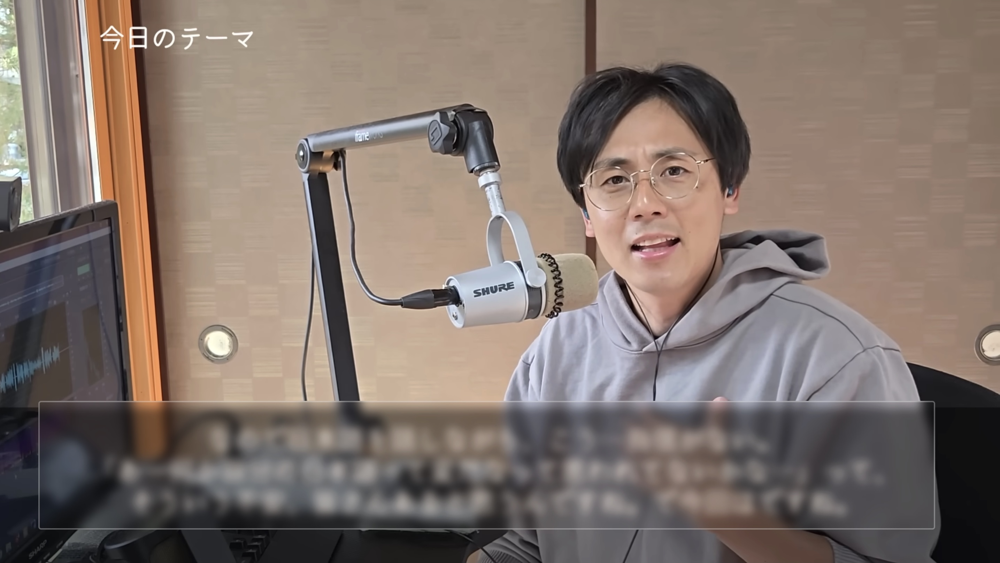

# Blur Bar YouTube

Blur hard subs on YouTube.

Hard subs are subtitles burned into the picture, so YouTube's caption button can't
switch them off — awkward if you're learning the language and want to train your
listening. Park a blurred bar over them and lift it only when you're stuck.

## Features

- Toggle the bar with the button or the shortcut (`b` by default).
- Drag to move the bar and use resize handles to fit the subtitle area.
- Configure the blur strength, shortcut key, and button visibility in the head of the userscript.
- The bar keeps its position between sessions.
- YouTube controls stay visible and clickable over the bar.

## Install

1. Install a userscript manager ([Tampermonkey](https://www.tampermonkey.net) or
   [Violentmonkey](https://violentmonkey.github.io)).
2. Open [**blur-bar-youtube.user.js**](https://raw.githubusercontent.com/constkolesnyak/blur-bar-youtube/main/blur-bar-youtube.user.js).
   The manager intercepts the `.user.js` URL and offers to install it in one click.
3. Confirm; it automatically runs on `www.youtube.com`.

## Credit

Partially inspired by [this](https://chromewebstore.google.com/detail/blur-bar-for-youtube-lang/mndlpifkemjipbkoejnekcieebmoicmk).
