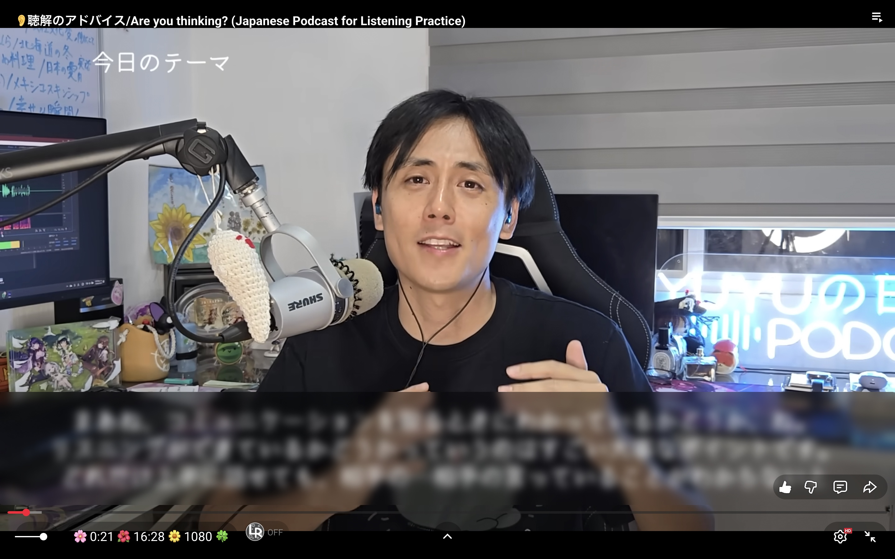

# Blur Bar YouTube

Blur hard subs on YouTube.

## Features

- Toggle the bar with the button or the shortcut (`b` by default).
- Drag to move the bar and use resize handles to fit the subtitle area.
- Configure the blur strength, shortcut key, and button visibility in the head of the userscript.
- The bar keeps its position between sessions.
- YouTube controls stay visible and clickable over the bar.

## Install

1. Install a userscript manager.
2. Create a new user script and paste the code from [`blur-bar-youtube.js`](blur-bar-youtube.js).
3. Save the script; it automatically runs on `www.youtube.com`.

## Credit

Partially inspired by [this](https://chromewebstore.google.com/detail/blur-bar-for-youtube-lang/mndlpifkemjipbkoejnekcieebmoicmk).
